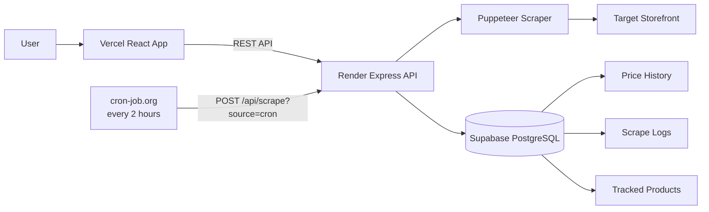

<div align="center">

<h1>Price Tracker</h1>

<p><em>A full stack price tracker built around a deliberately hostile scraping target.</em></p>

<p>
  <a href="https://price-tracker-ten-gold.vercel.app/">
    
  </a>
  <a href="https://price-tracker-3bxr.onrender.com">
    
  </a>
  <a href="https://github.com/samwill923/price-tracker">
    
  </a>
</p>

<p>
  
  
  
  
  
</p>

<p><code>Search</code> &rarr; <code>Track</code> &rarr; <code>Scrape</code> &rarr; <code>Validate</code> &rarr; <code>Store</code> &rarr; <code>Analyze</code></p>

</div>

## Overview

Price Tracker monitors product prices and stock levels from a hosted demo storefront that actively fights back.

**The dashboard isn't the interesting part. The scraper is.**

The storefront deliberately reproduces real world scraping pain: JavaScript only price rendering, delayed content, randomly generated CSS class names, randomized money formats, intermittent reveal price failures, and occasional upstream errors. So the scraper drives a real browser and leans on validation, retries, normalization, and attempt level logging instead of assuming one page load will ever be enough.

**What the app does**

* Search products by partial or full name
* Track and stop tracking any product
* Show current price, MRP and discount
* Show stock, seller and delivery info
* Render price history as a chart and a table
* Expose per product scrape logs
* Scrape automatically every 2 hours
* Support manual **Scrape Now** and **Scrape All**
* Handle retries and failures honestly

## Live Application

| Service | URL |
| :--- | :--- |
| **Frontend** | https://price-tracker-ten-gold.vercel.app/ |
| **Backend API** | https://price-tracker-3bxr.onrender.com |
| **Target Store** | https://demo.inelabteamdev.com/ |
| **Repository** | https://github.com/samwill923/price-tracker |

## Screenshots

<div align="center">


<sub><b>Dashboard.</b> Tracked products with live price, discount, stock and last sync, plus per card Scrape now.</sub>

<br><br>


<sub><b>Find products.</b> Partial name search across the warmed catalog, with already tracked items flagged.</sub>

<br><br>


<sub><b>Price history.</b> Current, lowest and highest recorded price over 61 stored points, as chart and table.</sub>

<br><br>


<sub><b>Scrape logs.</b> Every attempt for a single product, including retries and the reason each one failed.</sub>

<br><br>


<sub><b>Activity.</b> Global feed of all attempts, retries and failures across tracked products, newest first.</sub>

</div>

## Tech Stack

| Layer | Stack |
| :--- | :--- |
| **Frontend** | React 18 &middot; Vite 6 &middot; Lucide React &middot; responsive CSS (warm neutral, neumorphic inspired) |
| **Backend** | Node.js &middot; Express &middot; Puppeteer &middot; REST |
| **Data** | Supabase (PostgreSQL): `products`, `price_history`, `scrape_logs` |
| **Infra** | Vercel (frontend) &middot; Render (backend) &middot; cron-job.org (scheduling) |

## Architecture



<details>
<summary><b>Repository structure</b></summary>

```
price-tracker/
|-- backend/
|   |-- routes/
|   |   |-- products.js
|   |   +-- scrape.js
|   |-- scraper/
|   |   +-- scrapeProduct.js
|   |-- db.js
|   |-- server.js
|   |-- supabaseClient.js
|   |-- probe.js
|   |-- .puppeteerrc.cjs
|   +-- package.json
|
|-- frontend/
|   |-- src/
|   |   |-- components/
|   |   |-- lib/
|   |   |-- App.jsx
|   |   |-- index.css
|   |   +-- main.jsx
|   |-- index.html
|   |-- vite.config.js
|   +-- package.json
|
+-- README.md
```

</details>

## Scraper Reliability

The design goal was that the scraper keeps behaving correctly across unattended runs instead of silently storing bad data.

### Why Puppeteer

The storefront never exposes the final price as static HTML. It is revealed through browser side JavaScript behind an interaction gate, so the scraper reproduces the real browser interaction rather than trying to bypass the client side behaviour with a plain HTTP request.

### The reveal price interaction

The storefront expects genuine pointer behaviour before it gives up a price:

1. Enter the price area
2. Perform multiple pointer movements
3. Keep those movements sufficiently spaced apart
4. Dwell over the price area
5. Click **Reveal Price**
6. Wait for the success state and the rendered price

The first click can occasionally leave the price block idle. The scraper detects this and fires a second click before handing off to the outer retry mechanism.

### Retry strategy

Every product is scraped independently.

```
Product
   |
   v
Human-like interaction
   |
   v
Reveal Price
   |
   |-- success ........> Parse + validate + persist
   |
   +-- failure
          |
          v
        Retry
          |
          |-- success ..> Parse + validate + persist
          |
          +-- exhausted > Honest failure log
```

* Up to **5 attempts** per product
* Every attempt outcome recorded in `attemptLog`
* A single product failure never kills the batch
* A fresh Puppeteer page per product
* Values persisted **only after validation**
* A failed scrape never overwrites a known good current price

### Dynamic price extraction

The storefront rotates generated CSS suffixes (`pv-k2`, `pv-q9`, `pv-m4`, and so on), so hardcoding one class would be fragile. The scraper targets stable prefixes instead:

```css
[class*="pv-"]   /* price     */
[class*="mr-"]   /* MRP       */
[class*="bd-"]   /* breakdown */
```

The frontend never touches these selectors. It consumes the backend API only.

### Money parsing and Unicode normalization

The storefront randomizes price formatting. Observed in the wild:

| Raw text | Parsed |
| :--- | ---: |
| `₹6.093,00` | 6093.00 |
| `Rs. 6,093.00` | 6093.00 |
| `₹6 093` | 6093 |
| `₹1,94,531` | 194531 |

A dedicated money parser normalizes these before converting to numbers, with Unicode **NFKC** normalization applied first because the store injects zero width and full width characters into price text.

> Tested against **42 format and value combinations, 42 of 42 passing.** Extra validation rejects `0` and other invalid parses so they are never treated as a successful price.

### Honest logging and history

| Table | Holds |
| :--- | :--- |
| `products` | Tracked products |
| `price_history` | Successful price and stock snapshots over time |
| `scrape_logs` | Attempts and outcomes, including retries and failures |

That split matters: a failed scrape stays a failed scrape in the logs instead of becoming a fake successful price.

## API Overview

### Scraping

```http
POST /api/scrape
```

Manual runs may target specific products:

```json
{ "productIds": [868] }
```

The response carries a `runId` plus per product results.

### Products

```http
GET  /api/products/catalog
GET  /api/products/tracked
GET  /api/products/search?q=monitor
POST /api/products/track
```

Additional routes expose product history, scrape logs and stop tracking. The exact request and response contract lives in `backend/routes/`, which should be treated as the source of truth.

> The backend warms the storefront catalog incrementally because the storefront randomizes page order. Production startup has been observed warming **979 of 1000** products, so search works across the real catalog rather than a single page.

## Scheduled Scraping

Tracked products are rescraped every 2 hours. Because the backend runs on Render's free tier, scheduling is external via **cron-job.org**:

```http
POST https://price-tracker-3bxr.onrender.com/api/scrape?source=cron
```

**Why `source=cron`?** A full manual scrape can run long enough that an external scheduler would time out waiting. Cron requests are recognised by that flag and get an immediate:

```json
202 Accepted

{
  "status": "accepted",
  "message": "Scheduled scrape started"
}
```

The scrape then continues in the background and persists real results to Supabase.

## Local Setup

<details open>
<summary><b>1. Clone</b></summary>

```bash
git clone https://github.com/samwill923/price-tracker.git
cd price-tracker
```

</details>

<details open>
<summary><b>2. Backend</b></summary>

```bash
cd backend
npm install
```

Create `backend/.env`:

```env
SUPABASE_URL=your_supabase_project_url
SUPABASE_SERVICE_ROLE_KEY=your_supabase_service_role_key
```

Start the API:

```bash
node server.js
```

</details>

<details open>
<summary><b>3. Frontend</b></summary>

In a second terminal:

```bash
cd frontend
npm install
```

Create `frontend/.env.development`:

```env
VITE_API_BASE_URL=http://localhost:3000
```

Then:

```bash
npm run dev
```

For production builds the API base is `https://price-tracker-3bxr.onrender.com`.

</details>

> [!WARNING]
> Never commit `.env` files or service role credentials.

## Verification

```bash
# build the frontend
cd frontend && npm run build

# run the backend
cd ../backend && node server.js
```

Then walk the main flow:

```
Search product > Track product > Load tracked products > Scrape price and stock
      > Open details > View price history > View scrape logs > Stop tracking
```

For a headed scraper run, `backend/probe.js` is kept as the observable manual runner.

## Deployment

<table>
<tr><th align="left">Vercel, frontend</th><th align="left">Render, backend</th></tr>
<tr valign="top">
<td>

* Framework: **Vite**
* Root directory: `frontend`
* Output directory: `dist`

```env
VITE_API_BASE_URL=https://price-tracker-3bxr.onrender.com
```

</td>
<td>

* Root directory: `backend`
* Build: `npm install && npx puppeteer browsers install chrome`
* Start: `node server.js`

```env
SUPABASE_URL=...
SUPABASE_SERVICE_ROLE_KEY=...
```

</td>
</tr>
</table>

Puppeteer caches its browser under the deployed `node_modules` tree so Chromium is present at runtime.

## Known Limitations

* The scraper is tuned for **reliability over latency**, so multi product runs take a while because each product gets its own page and retry budget.
* The storefront's generated classes and randomized formatting are implementation details of the target site and may change.
* Three historical rows predate the final money parser fix (`0`, `6.093`, `11.915`). They are preserved deliberately rather than silently rewriting history.
* Supabase RLS was not configured for the current server side service role architecture.

## Engineering Highlights

The hard part was never *displaying* a price. It was deciding **when a price is trustworthy**.

```
Browser interaction
      v
Reveal success
      v
Rendered price detection
      v
Unicode normalization
      v
Money parsing
      v
Price validation
      v
Successful persistence
```

If any critical stage fails, the scraper retries or records an honest failure instead of writing bad data.

## Further Documentation

| File | Contents |
| :--- | :--- |
| `docs/DESIGN_NOTE.md` | Reliability decisions, trade offs, debugging history |
| `docs/RECORDING.md` | Headed run recording notes |
| `docs/screenshots/` | Application screenshots |

<div align="center">

<sub>React &middot; Express &middot; Puppeteer &middot; Supabase &middot; PostgreSQL &middot; Vercel &middot; Render</sub>

<br>

<a href="https://price-tracker-ten-gold.vercel.app/"><strong>Live Demo</strong></a>

</div>
